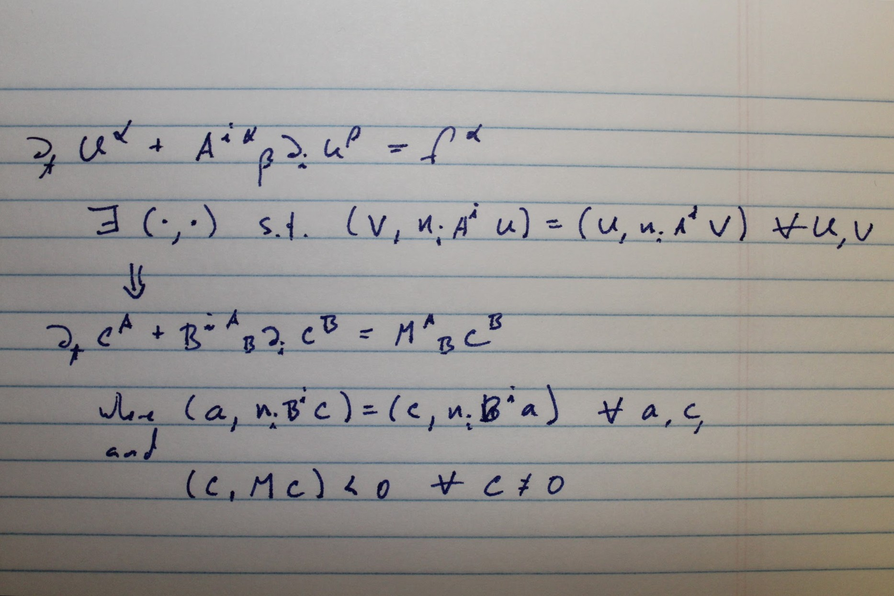
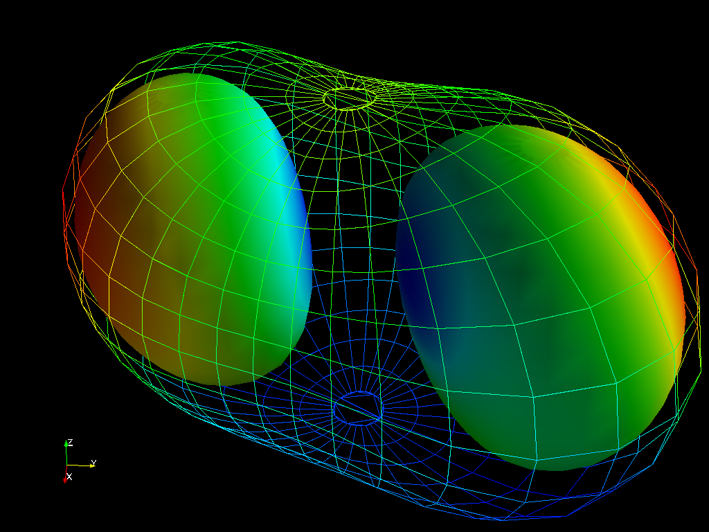
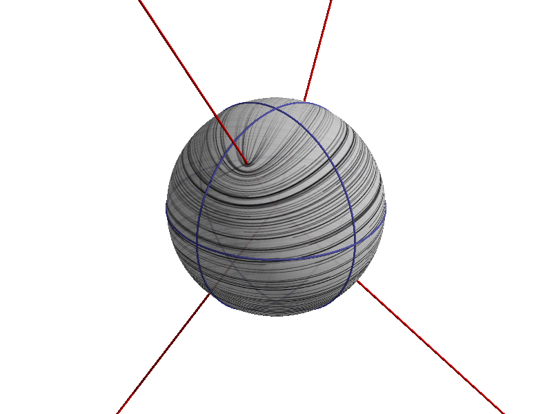

<!-- Banner -->
<!-- Note: The "styleN" class below should match that of the header element. -->
<section id="banner" class="style2">
	

		
			
		
		<header class="major">
			<h1>{{page.title}}</h1>
		</header>
		

			
{{ page.description }}

		

	

</section>

<!-- Main -->

<!-- One -->
<section id="one">
	

		<header class="major">
			<h2>Research</h2>
		</header>
		
This section will eventually contain intuitive descriptions of some of my research projects. As you can tell from the Lorem Ipsum below, none of these sections have been written yet.

	

</section>

<!-- Two -->
<section id="two" class="spotlights">
	<section>
		
		

			

				<header class="major">
					<h3>Representing the field equations</h3>
				</header>
				
Before a numerical relativity simulation can begin, we need to turn the physical field equations into a well-posed differential equations problem for the computer.

				<ul class="actions">
					<li><a href="research/fieldequations.html" class="button">Learn more</a></li>
				</ul>
			

		

	</section>
	<section>
		
		

			

				<header class="major">
					<h3>Black Hole Spin</h3>
				</header>
				
Characterizing a black-hole collision requires us to define what we mean by the angular momentum of warped space.

				<ul class="actions">
					<li><a href="research/spin.html" class="button">Learn more</a></li>
				</ul>
			

		

	</section>
	<section>
		
		

			

				<header class="major">
					<h3>Ringdown to the final state.</h3>
				</header>
				
It was long presumed that when two black holes collide, the merger remnant must settle down to a stationary black hole. Checking this required numerical relativity and some clever engineering.

				<ul class="actions">
					<li><a href="research/finalstate.html" class="button">Learn more</a></li>
				</ul>
			

		

	</section>
	<section>
		
		

			

				<header class="major">
					<h3>The dynamics of spacetime.</h3>
				</header>
				
Visualizing the stretching and squeezing of spacetime itself.

				<ul class="actions">
					<li><a href="research/spin.html" class="button">Learn more</a></li>
				</ul>
			

		

	</section>

</section>

<!-- Three -->
<!--
<section id="three">
	

		<header class="major">
			<h2>Massa libero</h2>
		</header>
		
Nullam et orci eu lorem consequat tincidunt vivamus et sagittis libero. Mauris aliquet magna magna sed nunc rhoncus pharetra. Pellentesque condimentum sem. In efficitur ligula tate urna. Maecenas laoreet massa vel lacinia pellentesque lorem ipsum dolor. Nullam et orci eu lorem consequat tincidunt. Vivamus et sagittis libero. Mauris aliquet magna magna sed nunc rhoncus amet pharetra et feugiat tempus.

		<ul class="actions">
			<li><a href="generic.html" class="button next">Get Started</a></li>
		</ul>
	

</section>
-->

