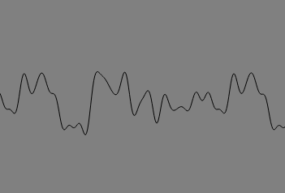
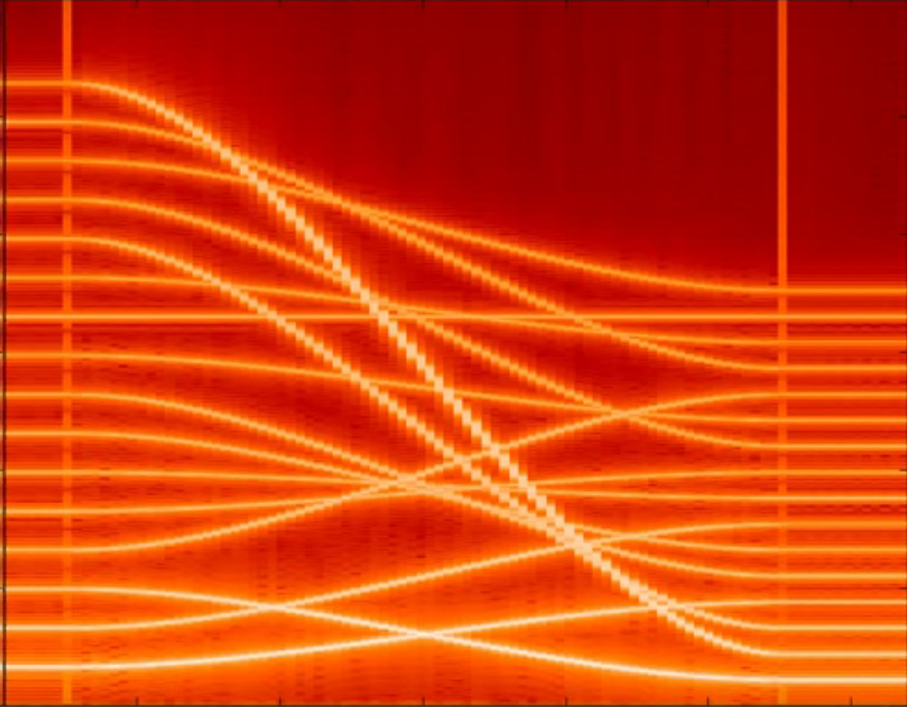
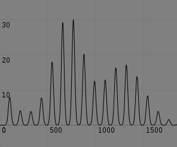
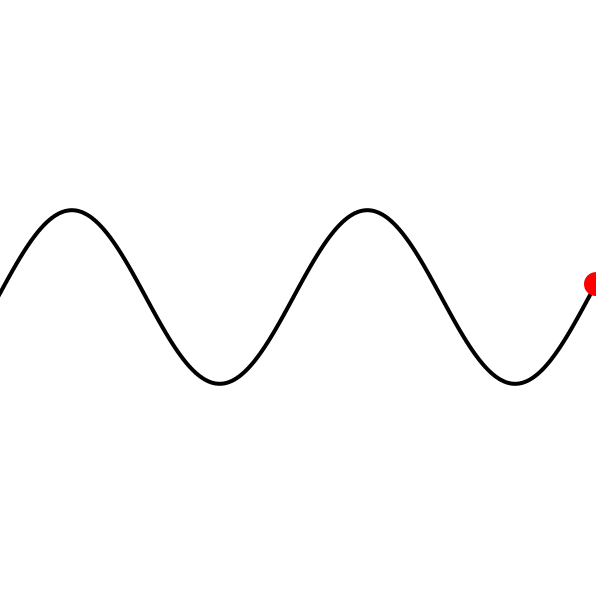
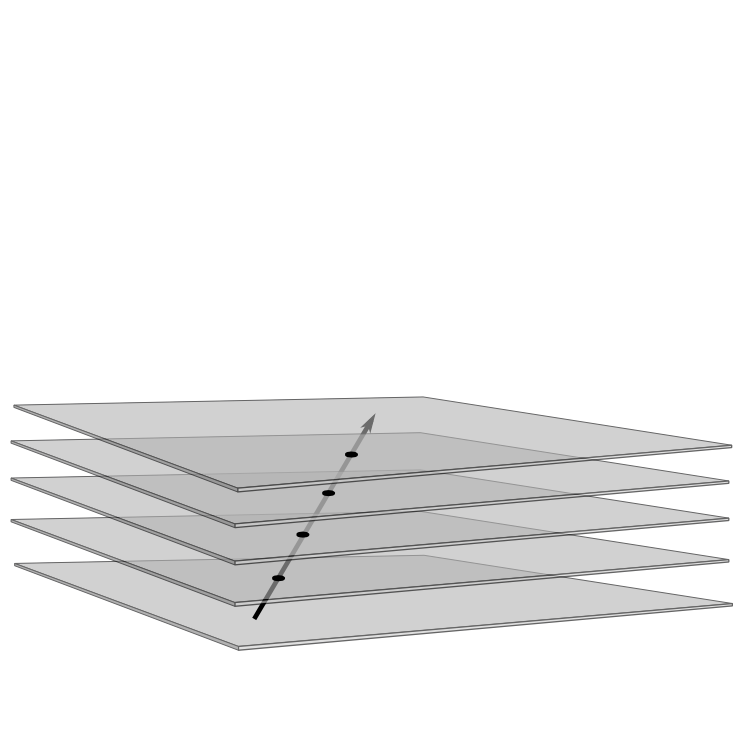

<!-- Banner -->
<!-- Note: The "styleN" class below should match that of the header element. -->
<section id="banner" class="style2">
	

		
			
		
		<header class="major">
			<h1>{{ page.title }}</h1>
		</header>
		

			
{{ page.description }}

		

	

</section>

<!-- Main -->

<!-- One -->
<section id="one">
	

		<header class="major">
			<h2>Visualizations</h2>
		</header>
		

Often, abstract ideas can be more easily understood when translated into visual terms. Either through teaching duties, or through ordinary curiosity, I often put together visualizations of one sort or another. Here are a few of them. For now the focus is on sound-related visualizations, mainly because they are of use in my acoustics course, but in time I'll develop a broader family of them.

	

</section>

<!-- Two -->
<section id="two" class="spotlights">
	<section>
		
		

			

				<header class="major">
					<h3>Just intonation</h3>
				</header>
				
An audio-visual demonstration of <i>just intonation</i> of the musical interval of a perfect fifth, and the imperfect approximation allowed by the twelve-tone equal-tempered scale. I expect to update this visualization soon to add fourths, thirds, and sixths.

				<ul class="actions">
					<li><a href="visualizations/justintonation.html" class="button">visit</a></li>
				</ul>
			

		

	</section>
	<section>
		
		

			

				<header class="major">
					<h3>Transharmonic glissandi</h3>
				</header>
				
Spectrographic exploration of harmonicity (a tool that our brains use to associate pitches to complex waveforms) being slowly broken and restored.

				<ul class="actions">
					<li><a href="visualizations/transharmonics.html" class="button">visit</a></li>
				</ul>
			

		

	</section>
	<section>
		
		

			

				<header class="major">
					<h3>Formants</h3>
				</header>
				
Fourier synthesis of a sawtooth wave, modulated by <it>formant resonances</it> such as those in the vocal cavity that give rise to the perception of vowel sounds.

				<ul class="actions">
					<li><a href="visualizations/formants.html" class="button">visit</a></li>
				</ul>
			

		

	</section>
	<section>
		
		

			

				<header class="major">
					<h3>Resonances of an ideal rope</h3>
				</header>
				
An ideal rope is fixed at one end, and swung at the other, at an adjustable frequency. The resulting <it>standing waves</it> have maximum amplitude for certain resonant frequencies and weaker amplitude for others.

				<ul class="actions">
					<li><a href="visualizations/swingingrope.html" class="button">visit</a></li>
				</ul>
			

		

	</section>
	<section>
		
		

			

				<header class="major">
					<h3>Formants</h3>
				</header>
				
A graphical representation of the inner product of a vector and a one-form.

				<ul class="actions">
					<li><a href="visualizations/innerproduct.html" class="button">visit</a></li>
				</ul>
			

		

	</section>

